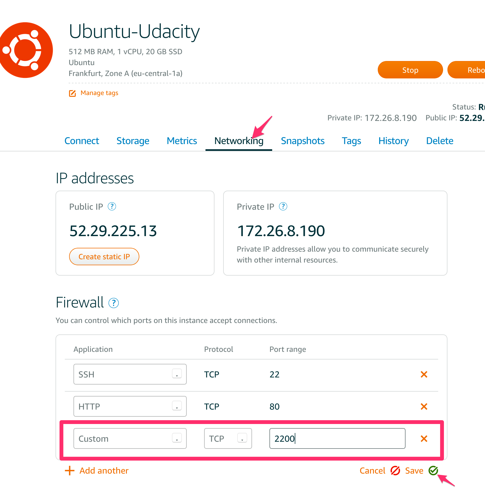
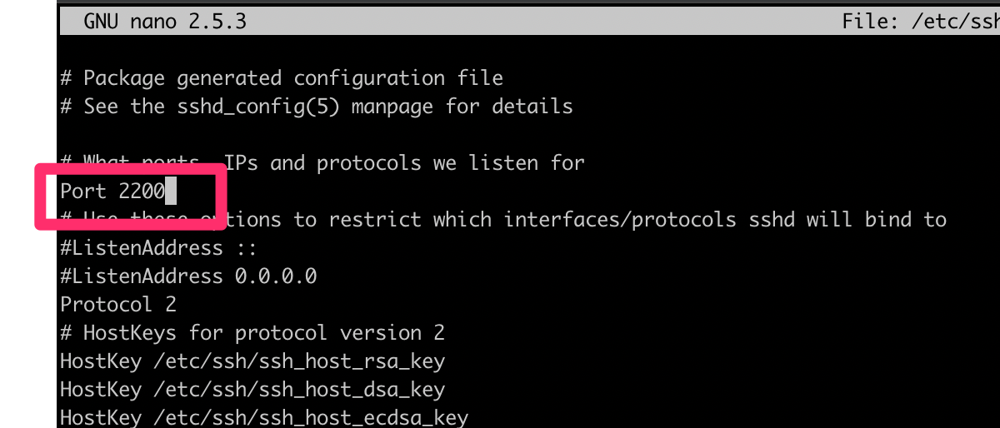
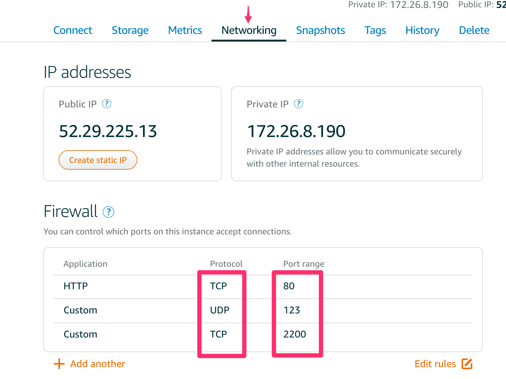
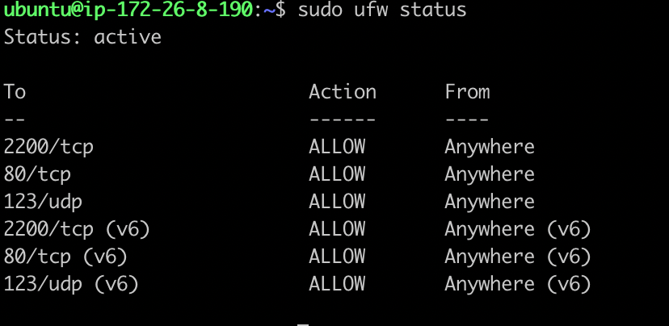

# udacity-linux-server-configuration


## Setup:

### ssh access:
first we create a ssh key to connect the aws instance.
it will genarate a private key and and public key
```
ssh-keygen -t rsa -b 4096
```

now open aws terminal. paste the public key (*.pub) key to the authorized_keys and save the file.

```
nano .ssh/authorized_keys
```

now we are able to login from external with our private key;
```
ssh ubuntu@52.29.225.13 -i ~/.ssh/<private key file>
```

### change ssh port:
if we change the ssh port we sould first open the new port on  the aws firewall:




now we are chaging the port from 22 to 2200 in the ssh config on the server.
open the ssh config file:
```
sudo nano /etc/ssh/sshd_config
```

change the listen port to 2200:


make also sure that only login with key pair is allowed:
so:
```
PasswordAuthentication no
```


restart the ssh service so the port changes happens:
```
sudo /etc/init.d/ssh restart
```

now test from the client if you can use the port 2200 for ssh connecting:
```
ssh ubuntu@52.29.225.13 -p 2200 -i .ssh/<private key file>
``` 

### firewall
we should only allow followin connections:
- SSH (port 2200) -> tcp
- HTTP (port 80) -> tcp
- NTP (port 123) -> udp

we have two firewalls: 
- the aws firwall 
- the server firewall "ufw"

for this course i will configure both firwalls similar:

1. AWS Firewall


2. ufw Firewall
make sure the firewall is not enabled: (otherwise you could block yourself out)
```
sudo ufw status
```

Now start with configuration, first block all incoming:
```
sudo ufw default deny incoming
```

Allow all outgoing:
```
sudo ufw default allow outgoing
```

Allow ingcoming ssh:
```
sudo ufw allow 2200/tcp
```
Allow incoming http:
```
sudo ufw allow 80/tcp
```
Allow incoming ntp:
```
sudo ufw allow 123/udp
```
Now we can activate the ufw firewall:
```
sudo ufw enable
```

Now we can check the configuration:
```
sudo ufw status
```
here we see our defined rules:


### Grader User
now lets create the grader user and add him to the sudo group

```
sudo adduser grader
``

Add the user to the sudo group:

```
sudo usermod -aG sudo grader
```

Now generation a ssh key for the grader user: (on the laptop)

```
ssh-keygen -t rsa -b 4096
```

on the server add the public key to the authorized_keys file of the grader user:

```
su grader
nano ~/.ssh/authorized_keys
```


## sources of information:
- udacity course (Deploying to Linux Servers)
- https://www.digitalocean.com/community/tutorials/how-to-create-a-sudo-user-on-ubuntu-quickstart
- http://www.linuxlookup.com/howto/change_default_ssh_port